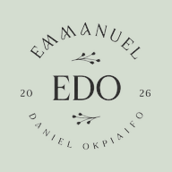

# Emmanuel (Daniel) Okpiaifo — Portfolio

<p align="center">
  
</p>

<p align="center">
  <strong>Web Developer (React &amp; WordPress) | Digital Platforms &amp; Product Delivery</strong>
</p>

<p align="center">
  Lagos, Nigeria ·
  <a href="mailto:emmaokpiaifo@gmail.com">Email</a> ·
  <a href="https://wa.me/2349160852509">WhatsApp</a> ·
  <a href="https://www.linkedin.com/in/emmanuel-okpiaifo">LinkedIn</a> ·
  <a href="https://github.com/Emmanuel-Okpiaifo">GitHub</a>
</p>

---

## Welcome

This is the official portfolio website of **Emmanuel (Daniel) Okpiaifo**.

I'm a web developer and digital operator in Lagos. As Technology Associate at NerdzFactory, I built the BizGrowth Africa platform end to end and keep the company's web platforms running. Part-time, I also run people operations at AfriVate, where I started as a Frontend Developer on its volunteer platform.

## What I can help you build

- Modern business and corporate websites
- React web applications and digital platforms
- WordPress and Elementor websites
- Content management systems
- Learning management systems and online course platforms
- Payment integrations, including Flutterwave
- AI chatbot and third-party service integrations
- Registration, application, and multi-step forms
- Google Sheets and Supabase workflow automations
- Website maintenance, security, SEO, and performance improvements
- Hosting, deployment, and ongoing technical support

## Why work with me?

- Building digital products since 2023
- **10+ key projects** delivered across business, education, and programme sites
- Programmes built for at NerdzFactory: **Google DeepMind, Raspberry Pi Foundation, Meta, GIZ, and LSETF**
- Experience taking products from planning and development through deployment and post-launch support
- A strong focus on responsive design, accessibility, reliability, performance, and clear user experiences
- Experience maintaining platforms at **98%+ monthly uptime**

## Selected work

### BizGrowth Africa

An end-to-end React ecosystem supporting African SMEs with business opportunities. The platform includes a custom CMS, Flutterwave payments, an AI chatbot, analytics, grant information, and a dedicated news platform.

[Visit BizGrowth Africa](https://bizgrowthafrica.com)

### Experience AI Nigeria

Built the national landing page for Experience AI Nigeria (Google DeepMind & Raspberry Pi Foundation), a programme that trained 1,142 teachers in its first year and targets 157,000 students by December 2026.

[View the Experience AI webpage](https://nerdzfactory.co/ai-schools/)

### Design and Digital Marketing School Lagos

Developed the 2026 programme website for a GIZ and LSETF-partnered training initiative, covering programme information, curriculum, applications, and cohort updates.

[View the programme website](https://designu.io/design-and-digital-marketing-school-lagos-2026/)

### DesignU Learning Platform

Configured and deployed the learning management system, including course structure, content organization, and student progress support.

[Visit the DesignU LMS](https://designu.io/courses/)

### Talentry Waitlist

Built a responsive waitlist landing page with automated Google Sheets data capture and supported its hosting and domain configuration.

[Visit Talentry](https://waitlist.talentry.com.ng/)

### YSEC Application Portal

Built multistep application forms with validation on WordPress for the Youth Sustainable Enterprise Challenge, a NerdzFactory programme, with improved accessibility and layout.

[View the YSEC portal](https://nerdzfactory.co/ysec/)

## What this website includes

The portfolio presents:

- A professional introduction and profile
- Career experience and measurable impact
- Selected live projects
- Technical skills and services
- Organizations and initiatives connected to my work
- Direct email, phone, WhatsApp, LinkedIn, and GitHub contact options
- A downloadable CV
- A responsive design for phones, tablets, and desktop computers

## Let’s work together

I'm open to web developer and digital operator roles in Nigeria: on-site, hybrid or remote.

- **Email:** [emmaokpiaifo@gmail.com](mailto:emmaokpiaifo@gmail.com)
- **Call:** [(+234) 916 085 2509](tel:+2349160852509)
- **WhatsApp:** [Start a conversation](https://wa.me/2349160852509)
- **LinkedIn:** [linkedin.com/in/emmanuel-okpiaifo](https://www.linkedin.com/in/emmanuel-okpiaifo)
- **GitHub:** [github.com/Emmanuel-Okpiaifo](https://github.com/Emmanuel-Okpiaifo)
- **Location:** Lagos, Nigeria

---

## For developers and contributors

The rest of this document explains how to run or update the website. You can ignore this section if you only want to learn about my work.

### Built with

- React
- Vite
- Tailwind CSS
- daisyUI
- React Router
- Font Awesome

### Run the website locally

You need [Node.js](https://nodejs.org/) installed on your computer.

```bash
git clone https://github.com/Emmanuel-Okpiaifo/Portifolio-website.git
cd Portifolio-website
npm install
npm run dev
```

The terminal will display a local address. Open that address in your browser.

### Available commands

```bash
npm run dev      # Start the local development version
npm run build    # Create the production-ready website
npm run preview  # Preview the production build
npm run deploy   # Deploy to GitHub Pages
```

### Update the portfolio content

Most written content is stored in:

```text
src/data/profile.js
```

Update this file to change the biography, skills, experience, projects, contact information, or partner organizations.

Main images and downloadable files are stored in:

```text
src/assets/
public/
```

### Deployment

The project is configured for:

- **Netlify** using `netlify.toml`
- **GitHub Pages** using the `npm run deploy` command

## Repository

[View the project source on GitHub](https://github.com/Emmanuel-Okpiaifo/Portifolio-website)

---

<p align="center">
  Built with care by <strong>Emmanuel (Daniel) Okpiaifo.</strong>
</p>
